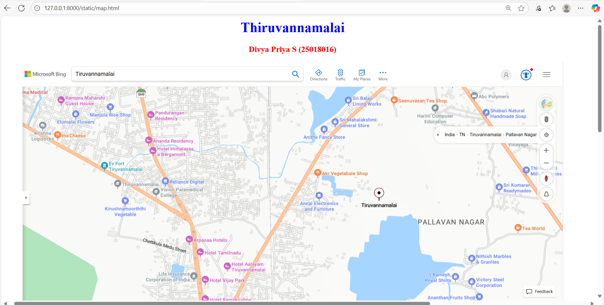
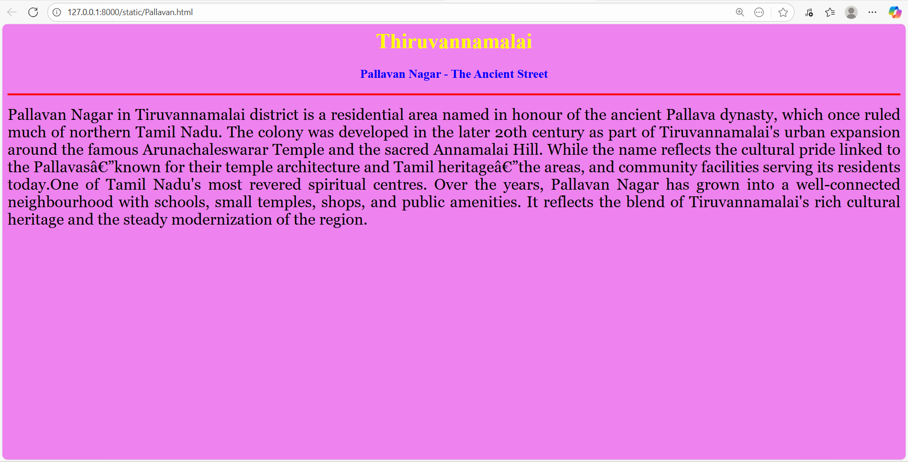
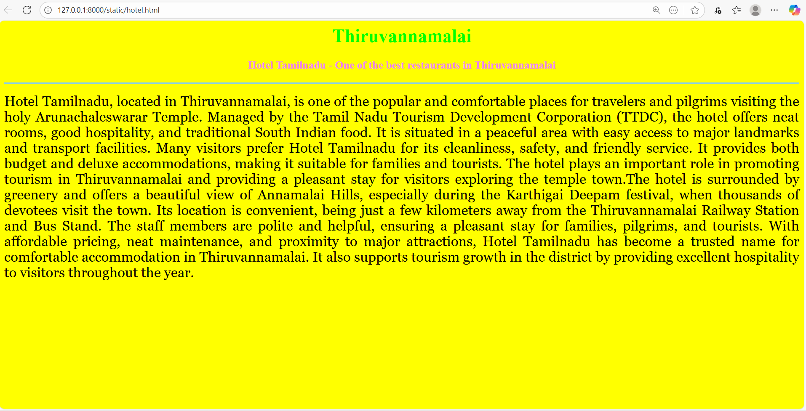
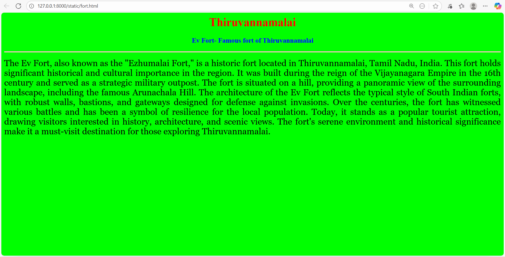
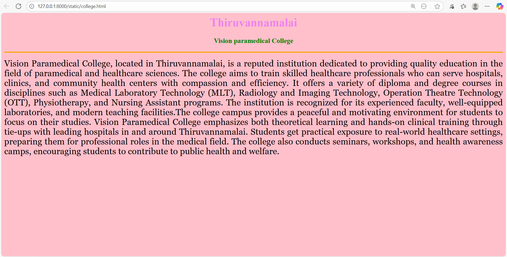
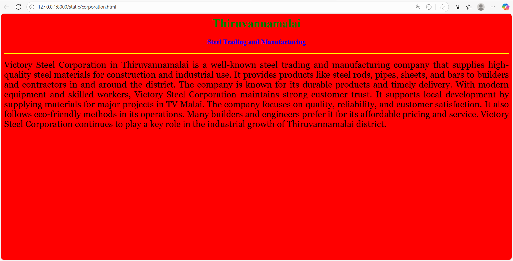

# Ex04 Places Around Me
## Date:08/10/2025

## AIM
To develop a website to display details about the places around my house.

## DESIGN STEPS

### STEP 1
Create a Django admin interface.

### STEP 2
Download your city map from Google.

### STEP 3
Using ```<map>``` tag name the map.

### STEP 4
Create clickable regions in the image using ```<area>``` tag.

### STEP 5
Write HTML programs for all the regions identified.

### STEP 6
Execute the programs and publish them.

## CODE
```
<html>
<head>
<title>My City</title>
</head>
<body>
    <h1 align = "Center">
        <font color="blue"><b>Thiruvannamalai</b></font>
    </h1>
    <h3 align="Center">
    <font color = "red"><b>Divya Priya S (25018016)</b></font>
</h3>
<center>
    
        <!-- Image Map Generated by http://www.image-map.net/ -->


<map name="image-map">
    <area target="_blank" alt="" title="" href="Pallavan.html" coords="1368,497,1650,635" shape="rect">
    <area target="_blank" alt="" title="" href="college.html" coords="453,440,671,512" shape="rect">
    <area target="_blank" alt="" title="" href="hotel.html" coords="599,644,789,706" shape="rect">
    <area target="_blank" alt="" title="" href="fort.html" coords="280,295,415,294,458,403,253,398" shape="poly">
    <area target="_blank" alt="" title="" href="corporation.html" coords="1553,740,1697,730,1758,803,1536,823,1544,762,1551,737" shape="poly">
</map>
</center>
</body>
    

</html>

college.html

<html>
<head>
<title>Paramedical College</title>
</head>
<body bgcolor="pink">
<h1 align="center">
<font color="violet"><b>Thiruvannamalai</b></font>
</h1>
<h3 align="center">
<font color="green"><b>Vision paramedical College </b></font>
</h3>
<hr size="3" color="orange">
<p align="justify">
<font face="Georgia" size="5">
    Vision Paramedical College, located in Thiruvannamalai, is a reputed institution dedicated to providing quality education in 
    the field of paramedical and healthcare sciences. The college aims to train skilled healthcare professionals who can serve
    hospitals, clinics, and community health centers with compassion and efficiency. It offers a variety of diploma and degree 
    courses in disciplines such as Medical Laboratory Technology (MLT), Radiology and Imaging Technology, Operation Theatre
    Technology (OTT), Physiotherapy, and Nursing Assistant programs. The institution is recognized for its experienced faculty,
    well-equipped laboratories, and modern teaching facilities.The college campus provides a peaceful and motivating environment
    for students to focus on their studies. Vision Paramedical College emphasizes both theoretical learning and hands-on clinical
    training through tie-ups with leading hospitals in and around Thiruvannamalai. Students get practical exposure to real-world
    healthcare settings, preparing them for professional roles in the medical field. The college also conducts seminars, 
    workshops, and health awareness camps, encouraging students to contribute to public health and welfare.
</font>
</p>
</body>
</html>

corporation.html

<html>
<head>
<title>Victory Steel Corporation</title>
</head>
<body bgcolor="red">
<h1 align="center">
<font color="green"><b>Thiruvannamalai</b></font>
</h1>
<h3 align="center">
<font color="blue"><b>Steel Trading and Manufacturing</b></font>
</h3>
<hr size="3" color="yellow">
<p align="justify">
<font face="Georgia" size="5">
 Victory Steel Corporation in Thiruvannamalai is a well-known steel trading and manufacturing company that supplies 
 high-quality steel materials for construction and industrial use. It provides products like steel rods, pipes, sheets, 
 and bars to builders and contractors in and around the district. The company is known for its durable products and timely 
 delivery. With modern equipment and skilled workers, Victory Steel Corporation maintains strong customer trust. It supports 
 local development by supplying materials for major projects in TV Malai. The company focuses on quality, reliability, and 
 customer satisfaction. It also follows eco-friendly methods in its operations. Many builders and engineers prefer it for 
 its affordable pricing and service. Victory Steel Corporation continues to play a key role in the industrial growth of 
 Thiruvannamalai district.
   
</font>
</p>
</body>
</html>

fort.html

<html>
<head>
<title>Ev fort</title>
</head>
<body bgcolor="lime">
<h1 align="center">
<font color="red"><b>Thiruvannamalai</b></font>
</h1>
<h3 align="center">
<font color="blue"><b>Ev Fort- Famous fort of Thiruvannamalai</b></font>
</h3>
<hr size="3" color="pink">
<p align="justify">
<font face="Georgia" size="5">
    The Ev Fort, also known as the "Ezhumalai Fort," is a historic fort located in Thiruvannamalai, Tamil Nadu, India. 
    This fort holds significant historical and cultural importance in the region. It was built during the reign of the 
    Vijayanagara Empire in the 16th century and served as a strategic military outpost. The fort is situated on a hill,
    providing a panoramic view of the surrounding landscape, including the famous Arunachala Hill. The architecture of 
    the Ev Fort reflects the typical style of South Indian forts, with robust walls, bastions, and gateways designed for 
    defense against invasions. Over the centuries, the fort has witnessed various battles and has been a symbol of 
    resilience for the local population. Today, it stands as a popular tourist attraction, drawing visitors interested 
    in history, architecture, and scenic views. The fort's serene environment and historical significance make it a must-visit
    destination for those exploring Thiruvannamalai.
</font>
</p>
</body>
</html>

hotel.html

<html>
<head>
<title>Hotel Tamilnadu</title>
</head>
<body bgcolor="yellow">
<h1 align="center">
<font color="lime"><b>Thiruvannamalai</b></font>
</h1>
<h3 align="center">
<font color="violet"><b>Hotel Tamilnadu - One of the best restaurants in Thiruvannamalai</b></font>
</h3>
<hr size="3" color="skyblue">
<p align="justify">
<font face="Georgia" size="5" color"white">
    Hotel Tamilnadu, located in Thiruvannamalai, is one of the popular and comfortable
    places for travelers and pilgrims visiting the holy Arunachaleswarar Temple.
    Managed by the Tamil Nadu Tourism Development Corporation (TTDC), the hotel
    offers neat rooms, good hospitality, and traditional South Indian food. 
    It is situated in a peaceful area with easy access to major landmarks and 
    transport facilities. Many visitors prefer Hotel Tamilnadu for its cleanliness,
    safety, and friendly service. It provides both budget and deluxe accommodations,
    making it suitable for families and tourists. The hotel plays an important role 
    in promoting tourism in Thiruvannamalai and providing a pleasant stay for visitors
    exploring the temple town.The hotel is surrounded by greenery and offers a beautiful
    view of Annamalai Hills, especially during the Karthigai Deepam festival, when
    thousands of devotees visit the town. Its location is convenient, being just a
    few kilometers away from the Thiruvannamalai Railway Station and Bus Stand.
    The staff members are polite and helpful, ensuring a pleasant stay for families,
    pilgrims, and tourists. With affordable pricing, neat maintenance, and proximity
    to major attractions, Hotel Tamilnadu has become a trusted name for comfortable 
    accommodation in Thiruvannamalai. It also supports tourism growth 
    in the district by providing excellent hospitality to visitors throughout the year.

    
</font>
</p>
</body>
</html>

pallavan.html

<html>
<head>
<title>pallavan Nagar</title>
</head>
<body bgcolor="violet">
<h1 align="center">
<font color="yellow"><b>Thiruvannamalai</b></font>
</h1>
<h3 align="center">
<font color="blue"><b>Pallavan Nagar - The Ancient Street </b></font>
</h3>
<hr size="3" color="red">
<p align="justify">
<font face="Georgia" size="5">
 Pallavan Nagar in Tiruvannamalai district is a residential area named in honour of the ancient Pallava dynasty,
 which once ruled much of northern Tamil Nadu. The colony was developed in the later 20th century 
 as part of Tiruvannamalai's urban expansion around the famous Arunachaleswarar Temple and the sacred Annamalai Hill. 
 While the name reflects the cultural pride linked to the Pallavas—known for their temple architecture and Tamil heritage—the areas,
 and community facilities serving its residents today.One of Tamil Nadu's most revered spiritual centres. Over the years, Pallavan Nagar
 has grown into a well-connected neighbourhood with schools, small temples, shops, and public amenities. It reflects the blend of
 Tiruvannamalai's rich cultural heritage and the steady modernization of the region.

</font>
</p>
</body>
</html>

```

## OUTPUT








## RESULT
The program for implementing image maps using HTML is executed successfully.
